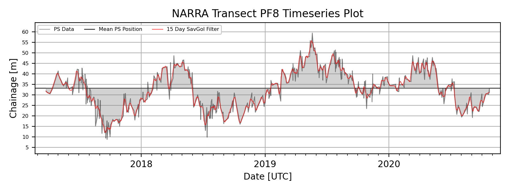

# CoastSat.PlanetScope

Yarran Doherty, UNSW Water Research Laboratory, 01/2021


## **Description**

CoastSat.PlanetScope is an open-source extension to the CoastSat python toolkit enabling users to extract time-series of shoreline position from PlanetScope Dove satellite imagery. Similar to CoastSat, the CoastSat.PlanetScope extension utilises a machine-learning shoreline detection algorithm to classify images into sand, water, whitewater and other pixel classes prior to a sub-pixel shoreline extraction process. An additional co-registration step is implemented to minimise the impact of geo-location errors. Transect intersection and a tidal correction  based on a generic beach slope is then applied to provide a timeseries of shoreline position. 


Output files include:
- Shoreline timeseries .geojson file for use in GIS software (no tidal correction)
- Tidally corrected shoreline transect intersection timeseries csv
- Image shoreline extraction plots
- Tidally corrected transect timeseries plots


## **Installation**

For users of Coastsat, the CoastSat.PlanetScope toolkit may be run in the original CoastSat environment once the following packages are installed:
- [Rasterio](https://rasterio.readthedocs.io/en/latest/installation.html)
- [AROSICS](https://danschef.git-pages.gfz-potsdam.de/arosics/doc/installation.html)

For first time users or where rasterio/arosics installation issues arise, a coastsat_ps environment may be installed using the provided environment.yml file. Refer section 1.1. of the [CoastSat](https://github.com/kvos/CoastSat) readme for installation instructions. The following code should be used in place of that outlined in the coastsat instructions:
```
conda env create -f environment.yml -n coastsat_ps

conda activate coastsat_ps
``` 

Note that the CoastSat.PlanetScope repo was written on a mac. Issues regarding environment installation on windows have been resolved however other issues may persist. Full windows support is still a work in progress and will hopefully be complete by April 2021. Please raise an issue for any bugs encountered to assist with this process. 

## **Data Requirements**

PlanetScope images must be manually downloaded by the user. 
- It is recommended this be done using the [QGIS Planet plugin](https://developers.planet.com/docs/integrations/qgis/quickstart/) which enables users to crop images to a user defined area of interest prior to download to reduce image file size. 
- Access to PlanetScope imagery can be obtained through a [free trial](https://www.planet.com/trial/), [research license](https://www.planet.com/markets/education-and-research/) or [paid subscription](https://www.planet.com/contact-sales/#contact-sales).
- To run CoastSat.PlanetScope, keep all downloaded images and associated metadata in a single folder and outline this folder filepath in the CoastSat_PS.py settings.
- Required PlanetScope file type is '4-band multispectral Analytic Ortho Scene'. These files should contain DN values and not TOA as explained [here](https://github.com/ydoherty/CoastSat.PlanetScope/issues/2#issuecomment-850956921).
- As outlined [here](https://github.com/ydoherty/CoastSat.PlanetScope/issues/2#issuecomment-828644872), downloaded udm2 files are not yet supported and may cause issues. These files (if present) should be deleted (manually or batch removed in python) prior to running CoastSat.PlanetScope. 

All user input files (area of interest polygon, transects & tide data) should be saved in the folder "...CoastSat.PlanetScope/user_inputs"
- Analysis region of interest .kml file may be selected and downloaded using [this tool](http://geojson.io). 
- Transects .geojson file (optional) should match the user input settings epsg. If skipped, transects may be drawn manually with an interactive popup. Alternately, the provided NARRA_transect.geojson file may be manually modified in a text editor to add/remove/update transect names, coordinates and epsg. 
- Tide data .csv for tidal correction (optional) should be in UTC time and local mean sea level (MSL) elevation. See NARRA_tides.csv for csv data and column name formatting. 

Beach slopes for the tidal correction (step 5) can be extracted using the [CoastSat.Slope toolkit](https://github.com/kvos/CoastSat.slope)


## **Usage**



It is recommended the toolkit be run in spyder. Ensure spyder graphics backend is set to 'automatic' for proper plot rendering. 
- Preferences - iPython console - Graphics - Graphics Backend - Automatic

CoastSat.PlanetScope is run from the CoastSat_PS.py file. 
- Instructions and comments are provided in this file for each step. 
- It is recommended steps be run as individual cells for first time users. 

Settings and interactive steps are based on the CoastSat workflow and will be familiar to users of CoastSat. 

Interactive popup window steps include:
- Raw PlanetScope reference image selection for co-registration [step 1.2.]
- Top of Atmosphere merged reference image selection for shoreline extraction [step 2.1.]
- Reference shoreline digitisation (refer 'Reference shoreline' section of CoastSat readme for example) - [step 2.1.]
- Transect digitisation (optional - only if no transects.geojson file provided) - [step 2.1.]
- Manual error detection (optional - keep/discard popup window as per CoastSat) - [step 3.]

Results and plots are saved in '...CoastSat.PlanetScope/outputs/site_name/shoreline outputs'. 


## **Known Issues**

The following issues have been identified by users and workarounds are presented below. My availability to maintain and update this repo is limited so user feedback, bug fixes and devlopments are encouraged! 
- Inability to select reference image - comment out [this](https://github.com/ydoherty/CoastSat.PlanetScope/issues/2#issuecomment-828644872) section of code. See [here](https://github.com/ydoherty/CoastSat.PlanetScope/issues/2#issuecomment-840894375) for explanation. Partially resolved (09/21) and alternate installation environment (environment_test.yml) is provided in development branch. 
- Environment and GDAL installation issues - see [here](https://github.com/ydoherty/CoastSat.PlanetScope/issues/2#issuecomment-830543064).


## **Training Neural-Network Classifier**

Due to the preliminary stage of testing, validation has only been completed at Narrabeen-Collaroy beach (Sydney, Australia). As such, the NN classifier is optimised for this site and may perform poorly at sites with differing sediment composition. It is recommended a new classifier be trained for such sites. 

Steps are provided in "...CoastSat.PlanetScope/coastsat_ps/classifier/train_new_classifier.py". 
- Instructions are in this file and based of the CoastSat classifier training [methods](https://github.com/kvos/CoastSat/blob/master/doc/train_new_classifier.md). 
- CoastSat.PlanetScope must be run up to/including step 1.3. on a set of images to extract co-registered and top of atmosphere corrected scenes for classifier training. 


## **Validation Results**

- Accuracy validated against in-situ RTK-GPS survey data at Narrabeen-Collaroy beach in the Northen beaches of Sydney, Australia with a RMSE of 3.66m (n=438). 
- An equivelent validation study at Duck, North Carolina, USA provided an observed RMSE error of 4.74m (n=167). 


Detailed results and methodology outlined in:

Doherty Y., Harley M.D., Vos K., Splinter K.D. (2021). Evaluation of PlanetScope Dove Satellite Imagery for High-Resolution, Near-Daily Shoreline Monitoring (in peer-review).
- Pre-print hopefully available in mid June 2021


