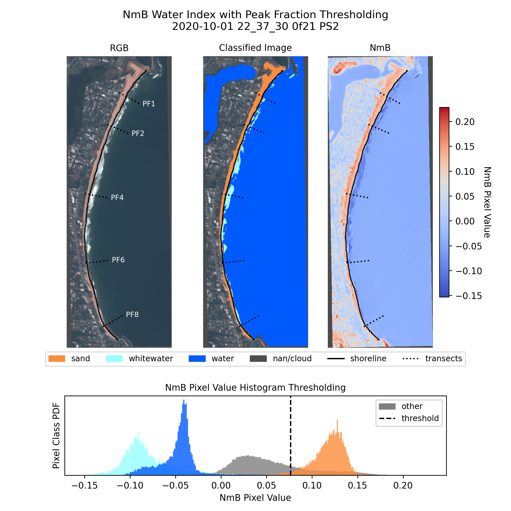

# CoastSat.PlanetScope

Yarran Doherty, UNSW Water Research Laboratory, 01/2021

## **Description**

CoastSat.PlanetScope is an open-source extension to the python toolkit CoastSat enabling users to extract time-series of shoreline psition from PlanetScope Dove satellite imagery. Similar to CoastSat, the CoastSat.PlanetScope extension utilises a machine learning shoreline detection algorithm to classify images into sand, water, whitewater and other pixel classes prior to a sub-pixel shoreline extraction process. An additional co-registration step is implemented to minimise the impact of geo-location errors. Transect intersection and a tidal correction  based on a generic beach slope is then applied to provide a time-series of shoreline position. 

Output files include:
- Shoreline timeseries .geojson file for use in GIS software
- Timeseries of raw transect intersection data in csv format
- Tidally corrected shoreline transect time-series csv
- Transect timeseries plots

## **Installation**

The CoastSat.PlanetScope toolkit is run in the original CoastSat environment. Refer CoastSat installation instructions 1.1. [https://github.com/kvos/CoastSat]. 

Additional packages to manually install in the coastsat environment are:
- Rasterio [pip install rasterio]
- AROSICS [https://danschef.git-pages.gfz-potsdam.de/arosics/doc/installation.html]

## **Usage**

It is recommended the toolkit be run in spyder. Ensure spyder graphics backend is set to 'automatic'
- Preferences - iPython console - Graphics - Graphics Backend - Automatic

CoastSat.PlanetScope is run from the CoastSat_PS.py file. Instructions and comments are provided in this file for each step. It is recommended steps be run as individual cells for first time users. 

Settings and interactive steps are based on the CoastSat workflow and will be familiar to users of CoastSat. 

Beach slopes for the tidal correction can be extracted using the CoastSat.Slope toolkit [https://github.com/kvos/CoastSat.slope]

## **Training Neural-Network Classifier**

Due to the preliminary stage of testing, validation has only been completed at Narrabeen-Collaroy beach in the Northern beaches of Sydney, Australia. As such, the NN classifier is optimised for this site and may perform poorly at sites with differing sediment composition. It is recommended a new classifier be trained for such sites. 

Steps are provided in the file "...CoastSat.PlanetScope/coastsat_ps/classifier/train_new_classifier.py". Instructions are provided in the file and are based of the CoastSat classifier training methods [https://github.com/kvos/CoastSat/blob/master/doc/train_new_classifier.md]. 

## **Validation Results**

Accuracy validated at Narrabeen-Collaroy beach with a RMSE of 3.51m. 

Detailed results and methodology outlined in:

Doherty Y., Harley M.D., Vos K., Splinter K.D. (2021). Evaluation of PlanetScope Dove Satellite Imagery for High-Resolution, Near-Daily Shoreline Monitoring (in peer-review)

